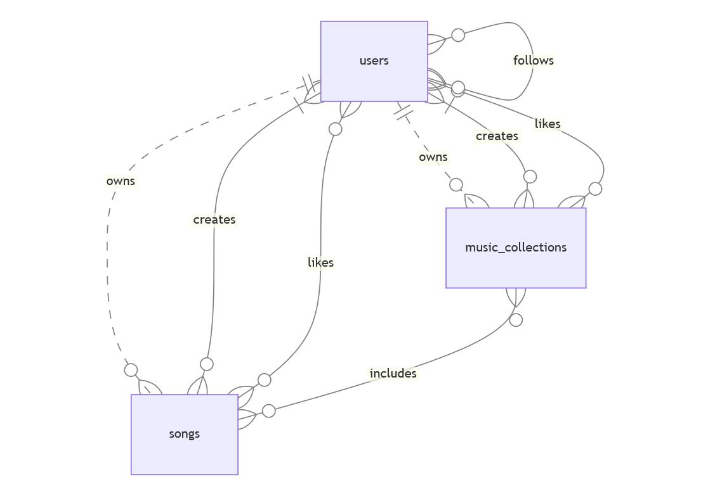

# Design Document

By Leonardo Cohen

Video overview: https://www.youtube.com/watch?v=LQKDwekCLuw

## Scope

The purpose of this database is to mimic basic functionalities spotify's database has.
The scope of the database includes, Users(artists, producers, basic users) and music_collections(albums, singles, playlists) that they consists of songs.
This database scope is not for selling music is just for music sharing.

## Functional Requirements

There are 2 types of Users, artists and basic users. Basic users, can create playlists with the existing songs in the database and collaborate with other users. They can also follow, artists other users and like albums, singles, playlists and songs. Artists are able to have the same functionalities as basic users but they are also able to create songs, albums and singles. The basic user cannot download music, artists cannot sell music.

## Representation

### Entities

There are 3 entities in the database:
* Users (Basic Users, Artists)
* Songs
* Music Collections(Singles, Albums, Playlist)

Users have the following attributes:
```SQL
    "id" INTEGER,
    "first_name" TEXT NOT NULL,
    "last_name" TEXT,
    "email" TEXT UNIQUE NOT NULL,
    "username" TEXT UNIQUE NOT NULL,
    "password" TEXT NOT NULL,
    "profile_picture" BLOB,
    "bio" TEXT,
    "artist_flag"  INTEGER NOT NULL CHECK("artist_flag" = 0 OR "artist_flag" = 1) DEFAULT 0,
    "subscription" TEXT NOT NULL CHECK("subscription" = 'free' OR "subscription" = 'premium' OR "subscription" = 'artist'),
    "soft_deletion" INTEGER NOT NULL CHECK("soft_deletion" = 0 OR "soft_deletion" = 1) DEFAULT 0,
    PRIMARY KEY("id")
```
Songs have the following attributes:

```SQL
    "id" INTEGER,
    "name" TEXT NOT NULL,
    "genre" TEXT,
    "time_sec" NUMERIC NOT NULL,
    "lyrics" TEXT,
    "language" TEXT,
    "date" NUMERIC NOT NULL,
    "owner_id" INTEGER,
    FOREIGN KEY("owner_id") REFERENCES "users"("id"),
    UNIQUE("name", "owner_id"),
    "wav_file" BLOB NOT NULL,
    PRIMARY KEY("id")
```

Music Collections have the following attributes:

```SQL
    "id" INTEGER,
    "name" TEXT NOT NULL,
    "info" TEXT,
    "cover" BLOB,
    "date_made" NUMERIC NOT NULL DEFAULT CURRENT_TIMESTAMP,
    "album_flag" INTEGER NOT NULL CHECK("album_flag" = 0 OR "album_flag" = 1) DEFAULT 0,
    "playlist_flag" INTEGER NOT NULL CHECK("playlist_flag" = 0 OR "playlist_flag" = 1) DEFAULT 0,
    "single_flag" INTEGER NOT NULL CHECK("single_flag" = 0 OR "single_flag" = 1) DEFAULT 0,
    "owner_id" INTEGER,
    UNIQUE("name", "owner_id"),
    FOREIGN KEY("owner_id") REFERENCES "users"("id"),
    PRIMARY KEY("id")
```
* Users :

   - **"id"**: It is an integer field. It represents a unique user ID and it serves the role of the primary key of this table.
   - **"first_name"** : It is a text field. It represents the first name of the user or artist/band name it should not be null, because we need a personalised method to address them.
   - **"last_name"** : It is a text field. It represents the last name of the user/artist.
   - **"email"** : It is a text field. It represents the email of the user. It has a UNIQUE constrain, because a user cannot make 2 different accounts with 1 email. It has NOT NULL constrain because all the users should identify themselves by their email.
   - **"username"** : It is a text field. It represents the username of the user. It is a unique nickname that user can use for identification purposes inside the app keeping his email private. It should not be null.
   - **"password"** : It is a text field. It represents the password of the user. The password should not be null.
   - **"profile_picture"** : It is a BLOB field. It represents the profile picture of the user.
   - **"bio"** : It is a text field. It represents a small bio about the user or the artist
   - **"artist_flag"** : It is an integer field. If it is 1 the user is an artist, if it is 0 the user is a basic user. So, we need to check if it is 0 or 1, and also it should not be null.
   - **"subscription"** : It is a text field. It represents the type of subscription "free", "premium" for basic users and "artists" for artists.
   - **"soft_deletion"** : It is an integer field.  If it is 1 the user is deleted, if it is 0 the user is active. So, we need to check if it is 0 or 1.

* Songs :

    - **"id"** : It is an integer field. It represents a unique song ID and it serves the role of the primary key of this table.
    - **"name"** : It is a text field. It represents the name of the song, it shouldn't be null, every song should have a name.
    - **"genre"** : It is a text field. It represents the genre or genres of the song.
    - **"time_sec"**: It is an integer field. It represents the duration of the song in seconds and it should not be null.
    - **"lyrics"**: It is a text field. It represents the lyrics of the song.
    - **"language"** : It is a text field. It represents the language of the lyrics of the song.
    - **"date"** : It is a numeric field. It represents the date that the song has been published or created.
    - **"owner_id"** : It is an integer field. It represents the id of the user that is the owner of the song (the owner is not always the creator, a song can have many creators but it should have only one owner). It serves a FOREIGN KEY and the combination **"name"** and **"owner_id"** should be unique.
    - **"wav_file"** : It is a BLOB field. It represents the song file and it should not be null. (In my case I ve commented out this field while creating the schema because I do not own the files of the songs that insert into the database).

* Music Collections:
    - **"id"** : It is an integer field. It represents a unique music_collection ID and it serves the role of the primary key of this table.
    - **"name"** : It is a text field. It represents the name of the music collection. It shouldn't be null, every music collection should have a name.
    - **"info"** : It is a text field. It represents the description of the music collection.
    - **"cover"** : It is a BLOB field. It represents the picture file that it will be displayed as the cover of the music collection.
    - **"date_made"** : It is a numeric field. It represents the date that the album was made it should not be null, if it is null use the current date.
    - **"album_flag"** : It is an integer. It represents the album flag. If it is 1 this entry is an album if it is 0 it is not an album.
    - **"playlist_flag"** : It is an integer. It represents the playlist flag. If it is 1 this entry is a playlist if it is 0 it is not a playlist.
    - **"single_flag"** : It is an integer. It represents the single flag. If it is 1 this entry is a single if it is 0 it is not a single.
    - **"owner_id"** : It is an integer field. It represents the id of the user that is the owner of the music collection (the owner is not always the creator, a music collection can have many creators but it should have only one owner). It serves as the FOREIGN KEY of the table and the combination **"name"** and **"owner_id"** should be unique.

### Relationships

The below entity relationship diagram describes the relationships among the entities in the database.


These relationship diagram describes 3 different functionalities:
* **The ownership functionality** :
    - 1 user owns 0 or more songs, but 1 song is owned by only 1 user.
    - 1 user owns 0 or more music collections, but 1 music collection is owned by only 1 user.
    - 1 music collection includes 0 or more songs, and 1 song is included in 0 or more music collections.

* **The collaboration functonality** :
    - 1 song can be created by 1 or many users
    - 1 music collection can be created by 1 or many users.

* **The liking functionality** :
    - 1 song can be liked by 0 or more users, but only once from each user.
    - 1 music collection can be liked by 0 or more users, but only once from each user.
    - 1 user can like 0 or more songs, music collections.
    - Users can also follow other users.
## Optimizations

I have created the following Views:

`active_artists` : The `users` that have `soft_deletion` 0 and `artist_flag` 1.

`active_users` : The `users` that have `soft_deletion` 0 and `artist_flag` 0.

`username_mc` : A view that makes it easier to make the connection between an `artist`'s `username` and the `name` of `music_collections` that he has created.

`username_song` :  A view that makes it easier to make the connection between an `artist`'s `username` and the `name` of `songs` that he has created.

`song_mc` : A view that makes it easier to make the connection between a `song`'s `name` and the `name` of `music_collections` that it is included.

`user_creates_mc_song` : A view that makes it easier to make the connection between an `artist`'s `username` and the `name` of `music_collections` and the `songs` in the them that he has created.

`user_likes_song_view` : A view that makes it easier to make the connection between a `users`'s `username` and the `names` of `songs` he\she\it likes.

`user_likes_mc_view` : A view that makes it easier to make the connection between a `users`'s `username` and the `names` of `music_collections` he\she\it likes.

`user_follows_user_view` : A view that makes it easier to make the connection between a `users`'s `username` and another `users`'s `username` that he\she\it follows.

## Limitations
The database is designed to use as less space as it is possible, but this is not the best method as it may face some problems with scalability if many users and artist's join the application, it might be more efficient to have distinct tables for each element. For example distinct tables for artists, users, playlists, singles and albums.
